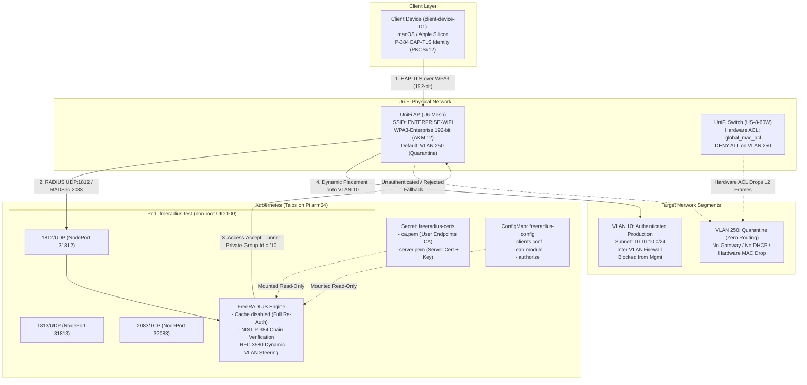
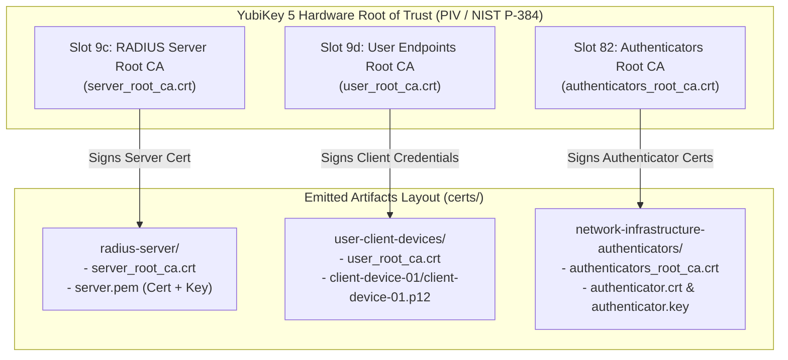

# Homelab 802.1X NAC (CNSA 1.0 Suite B 192-bit)

[](#cryptographic-specification)
[](#kubernetes-deployment-base-manifests)
[-326CE5.svg)](#kubernetes-deployment-base-manifests)
[-green.svg)](#segregated-3-ca-pki-architecture)
[](#network-architecture--hardware-l2-quarantine)
[](LICENSE)

An enterprise-grade **802.1X Network Access Control (NAC)** system deployed on Kubernetes (**Talos Linux on Raspberry Pi `arm64`**). This architecture enforces strict **NSA Commercial National Security Algorithm (CNSA 1.0 / Suite B 192-bit)** cryptography over **WPA3-Enterprise**, a hardware root of trust with **YubiKey PIV**, dynamic RFC 3580 VLAN steering, and hardware-enforced Layer 2 quarantine policies on Ubiquiti UniFi network hardware.

---

## Architectural Overview



---

## Repository Structure

```text
homelab-NAC/
├── certificate-authority/                   # PKI Generation Tools (CNSA P-384)
│   ├── generate-certificate-authorities.sh # YubiKey PIV hardware key generator (Slots 9c, 9d, 82)
│   └── generate-certs.sh                  # Multi-mode certificate provisioning engine
├── docker/                                 # FreeRADIUS Container Build
│   ├── Dockerfile                          # Minimal Alpine 3.24 unprivileged FreeRADIUS image
│   └── build.sh                            # Local container build helper
├── k8s/                                    # Base Kubernetes Manifests (Kustomize)
│   ├── 00-namespace.yaml                   # freeradius-experimentation namespace
│   ├── 01-deployment-test.yaml             # Hardened unprivileged FreeRADIUS deployment
│   ├── 02-service.yaml                     # NodePort service exposing 1812, 1813, 2083
│   ├── kustomization.yaml                  # Base Kustomize resource definition
│   ├── setup-ghcr-auth.sh                  # Pull secret setup helper
│   └── config/                             # Base configuration templates (.example)
│       ├── clients.conf.example            # Sanitized authenticator definitions
│       ├── authorize.example               # RFC 3580 identity-to-VLAN mapping
│       └── eap                             # Strict Suite B EAP-TLS configuration
├── examples/private-overlay/               # Decoupled Private Overlay Template
│   ├── README.md                           # Guide for private overlay architecture
│   ├── certs.env.example                   # Site parameter template (SANs, identities)
│   └── kustomization.yaml.example          # Overlay Kustomize manifest
├── test/                                   # Verification & Hardware Audit Harness
│   ├── run-test.sh                         # Containerized synthetic eapol_test runner
│   ├── yubikey-status.sh                   # Comprehensive read-only YubiKey auditor
│   ├── Dockerfile                          # Container recipe for eapol_test runtime
│   └── eapol_test.conf                     # EAP-TLS supplicant profile
└── notes/                                  # Architectural Proofs & Roadmaps
    ├── switch_acl_supported_on_us_8_60w.txt # Hardware CLI proof of L2 MAC ACLs
    └── client_hardening_and_secure_enclave.md # Scoped trust & Secure Enclave research
```

---

## Cryptographic Specification

This implementation strictly adheres to the **NSA CNSA 1.0 (Suite B 192-bit)** standard for national security systems and maximum commercial security:

| Cryptographic Domain | Standard / Implementation | Notes |
| :--- | :--- | :--- |
| **Asymmetric Curve** | **NIST P-384 (`secp384r1`)** | Enforced across all Root CAs, Server certificates, and Client keys. |
| **Digital Signatures** | **ECDSA with SHA-384** | SHA-256 and RSA signatures are rejected. |
| **EAP Transport Security** | **TLS 1.2 (`ECDHE-ECDSA-AES256-GCM-SHA384`)** | Strict cipher suite enforcement; Perfect Forward Secrecy guaranteed. |
| **Wi-Fi AKM Suite** | **IEEE 802.11 AKM 12 (`00:0f:ac:12`)** | `WPA (SHA384-SuiteB)` / WPA3-Enterprise 192-bit. |
| **Data Frame Cipher** | **GCMP-256 (`00:0f:ac:9`)** | Both Pairwise and Group ciphers use Galois/Counter Mode 256-bit. |
| **Management Frames** | **BIP-GMAC-256 (PMF Mandatory)** | Protected Management Frames enforced; non-PMF clients blocked. |
| **Session Cache Policy** | **Disabled (`cache { enable = no }`)** | Enforces full mutual TLS handshake on every reconnection (no session resumption). |
| **Server SAN Policy** | **DNS Domain Names (`FQDN`)** | Enforces valid DNS SANs (e.g. `radius.internal.example.com`) for strict supplicant validation. |

---

## Segregated 3-CA PKI Architecture

To prevent cross-domain credential misuse and enforce strict trust segregation, the PKI is partitioned into **three distinct, peer Root Certificate Authorities**. These are independent CAs rather than subordinate tiers, ensuring no single compromised key can compromise other trust domains:



### The Three Independent Trust Domains:
1. **RADIUS Server Root CA (PIV Slot `9c`)**:
   - Solely responsible for signing the FreeRADIUS server identity (`server.pem`).
   - Trusted by client devices (e.g. via Apple Configuration Profile) to authenticate the RADIUS server.
2. **User Endpoints Root CA (PIV Slot `9d`)**:
   - Solely responsible for issuing client device certificates (`<device-name>.p12`).
   - Trusted by FreeRADIUS (mounted as `ca.pem`) to authenticate client supplicants.
3. **Network Infrastructure Authenticators Root CA (PIV Slot `82`)**:
   - Solely responsible for issuing authenticator certificates (`authenticator.crt`/`.key`) to network hardware (e.g. UniFi APs for RadSec or mutual TLS infrastructure links).

### Hardware Root of Trust Guarantees:
* **Non-Exportable Keys:** Private keys are generated on-chip inside YubiKey PIV slots using `ykman` and cannot be read or extracted from the hardware.
* **Physical Touch Required (`TOUCH_POLICY_ALWAYS`):** Every certificate signing operation requires a physical touch on the YubiKey's capacitive sensor.
* **In-Memory PIN Capture:** The PIV PIN is captured interactively into process memory during CLI execution and is never stored on disk.
* **Software Fallback:** The certificate generation suite functions identically in disk-backed software mode when a YubiKey is not attached.

---

## Certificate Generation & Device Provisioning

The `certificate-authority/` directory provides comprehensive tooling for initializing hardware CAs, bootstrapping infrastructure, and onboarding client devices.

### 1. (Optional) Initialize Hardware CAs on YubiKey
To generate the three NIST P-384 hardware private keys inside a connected YubiKey 5:

```bash
cd certificate-authority

# Provision hardware keys for ALL 3 CAs (Slots 9c, 9d, 82)
./generate-certificate-authorities.sh --all

# Or target a specific CA:
./generate-certificate-authorities.sh --server         # Slot 9c
./generate-certificate-authorities.sh --user           # Slot 9d
./generate-certificate-authorities.sh --authenticators # Slot 82
```

### 2. Bootstrap Infrastructure Credentials
Generate the three Root CA certificates, FreeRADIUS server certificate, and network authenticator credentials:

```bash
# Software Mode (Disk-backed Root CAs):
./generate-certs.sh --full-with-defaults

# Hardware Root of Trust Mode (YubiKey PIV via step-kms-plugin):
./generate-certs.sh --full-with-defaults --yubikey
```

### 3. Onboard Individual Client Devices
Issue an 802.1X client identity bundle:

```bash
# Issues user-client-devices/client-device-01/client-device-01.p12
./generate-certs.sh --client client-device-01 [--yubikey]
```

* **Automated PKCS#12 Bundling:** Automatically packages the client certificate, private key, and trust chain into an encrypted `.p12` bundle using legacy PBES1 encryption (required for macOS Keychain Access compatibility).
* **Cryptographic Hygiene:** Unencrypted plaintext leaf `.key` and `.crt` files are securely purged from disk immediately after bundle packaging. _TODO: Keep these in memory and never write them to disk in the first place._
* **File Permissions:** Sets `0600` permissions on the generated `.p12` file.

### 4. Rotate RADIUS Server Certificate in Isolation
Rotate or renew the FreeRADIUS TLS certificate without disturbing client credentials or authenticator keys:

```bash
./generate-certs.sh --server [--yubikey]
```

---

## Network Architecture & Hardware L2 Quarantine

```
                                      ┌─────────────────────────────────────────┐
                                      │ UniFi US-8-60W Switch (Hardware L2 ACL) │
                                      │                                         │
┌─────────────────────────┐           │ ┌─────────────────────────────────────┐ │
│ Client Associated with  │           │ │ Inbound Switch Port ACL:            │ │
│ SSID: ENTERPRISE-WIFI   │───────────┼─▶ deny any any vlan eq 250            │ │
│ Default: VLAN 250       │           │ │ (Hardware-level packet drop)        │ │
└────────────┬────────────┘           │ └─────────────────────────────────────┘ │
             │                        └─────────────────────────────────────────┘
             │ EAP-TLS Handshake
             ▼
┌─────────────────────────┐           ┌─────────────────────────────────────────┐
│ FreeRADIUS (Kubernetes) │           │ Production VLAN 10 (10.10.10.0/24)      │
│ Access-Accept:          │───────────┼─▶ RFC 3580 Dynamic Steering             │
│ Tunnel-Private-Group=10 │           │ Workstations isolated from Mgmt VLAN 50 │
└─────────────────────────┘           └─────────────────────────────────────────┘
```

### 1. Default-Deny Hardware Quarantine (VLAN 250)
The wireless SSID (`ENTERPRISE-WIFI`) maps unauthenticated clients to **VLAN 250**:
* **Zero Routing & No DHCP:** Configured as a "Third-Party Gateway" network without DHCP services or gateway routing.
* **Hardware Switch Port ACL:** Ports on the UniFi `US-8-60W` switch enforce a hardware-level extended MAC access list ([verified via CLI](notes/switch_acl_supported_on_us_8_60w.txt)):
  ```text
  mac access-list extended global_mac_acl
  deny any any vlan eq 250
  permit any any
  exit
  ```
  Unauthenticated clients placed on VLAN 250 cannot transmit or receive Layer 2 frames laterally or vertically. _TODO: What about broadcast / multicast L2 traffic?_

### 2. Dynamic RFC 3580 VLAN Steering
Upon successful mutual EAP-TLS authentication of an approved identity (e.g. `client-device-01`), FreeRADIUS returns standard RFC 3580 tunnel attributes in the `Access-Accept` response:
```text
Tunnel-Type = VLAN (13)
Tunnel-Medium-Type = IEEE-802 (6)
Tunnel-Private-Group-Id = "10"
```
The UniFi AP dynamically bridges the client's session into **VLAN 10** (`10.10.10.0/24`).

### 3. Inter-VLAN Firewall Isolation
Workstations on VLAN 10 have full outbound internet access but are blocked by gateway firewall rules from routing into management VLAN 50 (`10.50.0.0/24`), protecting Kubernetes cluster nodes from lateral traversal.

---

## Kubernetes Deployment (Base Manifests)

The `k8s/` directory contains base manifests managed via Kustomize.

### 1. Hardened Container Architecture
* **Unprivileged Daemon:** Runs as unprivileged UID 100 (`radius`), GID 101 (`radius`).
* **Privilege Restriction:** `allowPrivilegeEscalation: false`, all Linux capabilities dropped (`drop: ["ALL"]`).
* **Seccomp:** `RuntimeDefault` profile enforced.
* **Pinned Image:** Alpine-based FreeRADIUS image pinned by digest:
  `ghcr.io/andrewnicolalde/homelab-nac/freeradius@sha256:b74e8d0cf81d4e37b4601e2c45225c9f78f350d8ad7ff27c81f0964d3f09757c`

### 2. Service Endpoints
The FreeRADIUS service exposes:
* `1812/UDP` (NodePort 31812): RADIUS Authentication
* `1813/UDP` (NodePort 31813): RADIUS Accounting
* `2083/TCP` (NodePort 32083): RADSec (RADIUS over TLS)

### 3. Deploying Base Manifests
To preview or deploy the base manifests with sanitized example configurations:

```bash
# Preview manifests:
kubectl kustomize ./k8s

# Apply to cluster:
kubectl apply -k .
```

---

## Deployment Pattern: Decoupled Private Overlay

To keep this public repository clean of private IP subnets, live RADIUS secrets, and site-specific certificates, production deployments should use a **separate private repository** (e.g. `homelab-network-private`) that consumes this repository as a remote Kustomize base:

```
┌────────────────────────────────────────────────────────┐
│ PUBLIC REPOSITORY (homelab-NAC)                        │
│ - Base manifests (k8s/01-deployment-test.yaml, etc.)   │
│ - Config templates (.example)                          │
│ - Cryptographic scripts and test suites                │
└───────────────────────────▲────────────────────────────┘
                            │ remote base reference
┌───────────────────────────┴────────────────────────────┐
│ PRIVATE OVERLAY (homelab-network-private)              │
│ - kustomization.yaml (overlays remote base)            │
│ - Live clients.conf, authorize, and eap configs        │
│ - Live certificates and Kubernetes secrets             │
└────────────────────────────────────────────────────────┘
```

See [examples/private-overlay](examples/private-overlay) for turnkey templates and setup instructions.

---

## Verification & Testing Harness

### 1. Synthetic EAP-TLS Testing (`eapol_test`)
Before connecting over physical Wi-Fi, run the containerized `eapol_test` suite (supporting Docker or Podman) to validate TLS 1.2 Suite B negotiation and dynamic VLAN assignment:

```bash
./test/run-test.sh [RADIUS_SERVER] [PORT] [RADIUS_SECRET]
```

* **Validation Criteria:**
  - Full TLS 1.2 mutual handshake with `ECDHE-ECDSA-AES256-GCM-SHA384`.
  - Derivation of MPPE send/receive keys.
  - Return of `Tunnel-Private-Group-Id = "10"` (or configured VLAN).
  - Validation of `Tunnel-Type = VLAN` and `Tunnel-Medium-Type = IEEE-802`.

### 2. YubiKey Hardware State Auditor (`yubikey-status.sh`)
Audit connected YubiKey devices across all subsystems with zero state changes:

```bash
./test/yubikey-status.sh
```

* **Read-Only Inspection:**
  - Inspects PIV slots (`9a`, `9c`, `9d`, `9e`), certificate validity, fingerprints, and touch policies.
  - Inspects OpenPGP, FIDO2/WebAuthn, and OATH TOTP application status.
  - Verifies macOS CryptoTokenKit / PC/SC smartcard subsystem visibility.
  - Evaluates hardware Root CA suitability and firmware security advisory posture (ROCA and EUCLEAK / CVE-2024-45678).

### 3. Over-the-Air Physical Wi-Fi Verification
1. Associate client with SSID `ENTERPRISE-WIFI`.
2. Verify AKM on macOS without `sudo`:
   ```bash
   ipconfig getsummary en0 | grep -i security
   # Expected: Security : SHA384_8021X (IEEE 802.11 AKM 12)
   ```
3. Inspect over-the-air beacon frames via `tshark`:
   ```bash
   tshark -r ./wifi_cnsa_capture.pcap -Y "wlan.rsn.akms.type == 12" -V | grep -A 10 "Tag: RSN Information"
   ```
   Confirms `GCMP (256)` ciphers and `WPA (SHA384-SuiteB) (12)`.

---

## Security Roadmap & Milestones

Technical details and implementation notes are documented in [`notes/client_hardening_and_secure_enclave.md`](notes/client_hardening_and_secure_enclave.md):

* [x] **YubiKey Hardware Root of Trust:** 3-CA architecture using YubiKey PIV with `ECCP384` and `TOUCH_POLICY_ALWAYS`.
* [x] **DNS FQDN Server SANs:** Compliant with modern 802.1X supplicant validation standards.
* [x] **Automated macOS PBES1 PKCS#12 Packaging:** Turnkey client onboarding with automated trust chain bundling.
* [ ] **Software Mode in `generate-certificate-authorities.sh`:** Add standalone disk-backed 3-CA generation and rotation to `generate-certificate-authorities.sh` (bringing standalone CA initialization parity to software mode).
* [ ] **Scoped `.mobileconfig` Profiles:** Scoping Root CA trust exclusively to `ENTERPRISE-WIFI` via Apple Configuration Profile payloads (`PayloadCertificateAnchorUUID` and `TLSTrustedServerNames`), preventing web/HTTPS MITM exposure.
* [ ] **Hardware-Backed Client Keys:** Generating client keys inside Apple Secure Enclave (`kSecAttrTokenIDSecureEnclave` / P-256) or YubiKey PIV Smart Card (P-384).
* [ ] **RADIUS Dynamic Authorization / CoA (RFC 3576):** Change of Authorization disconnect messages for immediate session termination.

---

## License

This project is licensed under the [MIT License](LICENSE).
