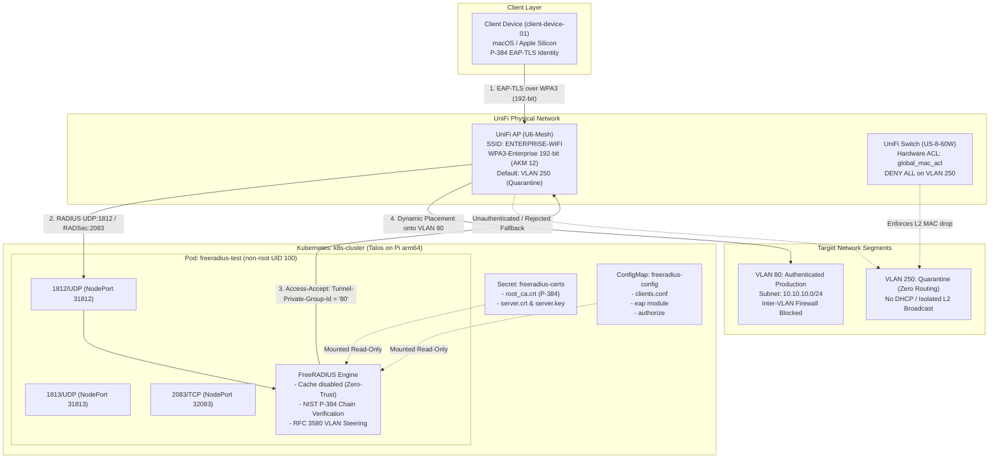

# Homelab Zero-Trust 802.1X NAC (CNSA 1.0 Suite B 192-bit)

[](#cryptographic-specification)
[](#kubernetes-infrastructure)
[-326CE5.svg)](#kubernetes-infrastructure)
[](#network-architecture--quarantine-design)

An enterprise-grade, zero-trust **802.1X Network Access Control (NAC)** system deployed on Kubernetes (**Talos Linux on Raspberry Pi**). This architecture enforces strict **NSA Commercial National Security Algorithm (CNSA 1.0 / Suite B 192-bit)** cryptography over **WPA3-Enterprise**, dynamic RFC 3580 VLAN steering, and hardware-enforced Layer 2 quarantine policies on Ubiquiti UniFi network hardware.

---

## Architectural Overview



---

## Cryptographic Specification

This implementation strictly adheres to the **NSA CNSA 1.0 (Suite B 192-bit)** standard for national security systems and maximum commercial security:

| Cryptographic Domain | Standard / Implementation | Notes |
| :--- | :--- | :--- |
| **Asymmetric Curve** | **NIST P-384 (`secp384r1`)** | Enforced across Root CA, Server, and Client keys. |
| **Digital Signatures** | **ECDSA with SHA-384** | SHA-256 and RSA signatures are rejected. |
| **EAP Transport Security** | **TLS 1.2 (`ECDHE-ECDSA-AES256-GCM-SHA384`)** | Strict cipher suite enforcement; PFS guaranteed. |
| **Wi-Fi AKM Suite** | **IEEE 802.11 AKM 12 (`00:0f:ac:12`)** | `WPA (SHA384-SuiteB)`. |
| **Data Frame Cipher** | **GCMP-256 (`00:0f:ac:9`)** | Both Pairwise and Group ciphers use Galois/Counter Mode 256-bit. |
| **Management Frames** | **BIP-GMAC-256 (PMF Mandatory)** | Protected Management Frames enforced; non-PMF clients blocked. |
| **Session Cache Policy** | **Disabled (`cache { enable = no }`)** | Enforces full mutual TLS handshake on every connection (zero-trust). |

---

## Network Architecture & Quarantine Design

### 1. Default-Deny Quarantine (VLAN 250)
The wireless SSID (`ENTERPRISE-WIFI`) is configured with its default network mapped to **VLAN 250**:
* **No Gateway / No DHCP:** Configured as a "Third-Party Gateway" network in UniFi without DHCP or routing.
* **Hardware Switch ACLs:** UniFi `US-8-60W` switch ports enforce a hardware-level extended MAC ACL (`global_mac_acl`):
  ```text
  mac access-list extended global_mac_acl
  deny any any vlan eq 250
  exit
  ```
  Bound `inbound` on all physical switch ports `0/1` through `0/8`. Unauthenticated clients placed in VLAN 250 cannot send or receive frames laterally or vertically.

### 2. Dynamic RFC 3580 VLAN Steering
Upon successful mutual EAP-TLS authentication of identity `client-device-01`, FreeRADIUS injects standard RADIUS tunnel attributes into the `Access-Accept` response:
```text
Tunnel-Type = VLAN (13)
Tunnel-Medium-Type = IEEE-802 (6)
Tunnel-Private-Group-Id = "80"
```
The UniFi AP dynamically re-tags the client's wireless session and bridges it into **VLAN 80** (`10.10.10.0/24`).

### 3. Inter-VLAN Firewall Isolation
Workstations on VLAN 80 (`10.10.10.0/24`) have full internet access but are categorically prohibited by gateway firewall rules from routing into management VLAN 50 (`10.50.0.0/24`), protecting the Talos Kubernetes cluster from lateral access.

---

## Deployment Guide

### 1. Prerequisites
* **Local Tools:** `git`, `step` (Smallstep CLI), `openssl` (LibreSSL/OpenSSL), `kubectl`, `kustomize`, `docker` / `podman`.
* **Hardware:** UniFi Access Point (Wi-Fi 6 / U6 or newer supporting WPA3-Enterprise 192-bit) and UniFi Switch.
* **Cluster:** Kubernetes cluster (e.g. Talos Linux) with node IP reachable by the UniFi AP.

### 2. Generate Cryptographic Credentials
Run the automated generation script to create the full NIST P-384 certificate hierarchy:
```bash
cd certificate-authority
./generate-certs.sh
```

To export the macOS client identity bundle:
```bash
/usr/bin/openssl pkcs12 -export \
    -in client.crt \
    -inkey client.key \
    -certfile root_ca.crt \
    -out client.p12
```

### 3. Deploy to Kubernetes
1. Copy [`k8s/config/clients.conf.example`](k8s/config/clients.conf.example) to `k8s/config/clients.conf` (gitignored) and configure your NAS clients, AP/workstation IPs, and RADIUS secrets.
2. Generate GitHub Container Registry secret (if pulling private image):
   ```bash
   ./k8s/setup-ghcr-auth.sh <GITHUB_USERNAME> <GITHUB_PAT>
   ```
3. Apply the manifests using Kustomize:
   ```bash
   kubectl apply -k .
   ```
4. Verify pod health and tail logs:
   ```bash
   kubectl get pods -n freeradius-experimentation
   kubectl logs -n freeradius-experimentation -l app=freeradius -f
   ```

---

## Verification & Testing

### 1. Synthetic EAP-TLS Testing (`eapol_test`)
Before testing over physical Wi-Fi, run the containerized `eapol_test` suite to assert cryptographic compliance and VLAN steering:
```bash
./test/run-test.sh
```
* **Success Criteria:** Completes full TLS 1.2 handshake (`ECDHE-ECDSA-AES256-GCM-SHA384`), derives MPPE send/receive keys, and receives `Tunnel-Private-Group-Id = "80"`.

### 2. Over-the-Air Physical Wi-Fi Verification
1. Associate client with SSID `ENTERPRISE-WIFI`.
2. Verify AKM on macOS without `sudo`:
   ```bash
   ipconfig getsummary en0 | grep -i security
   # Output: Security : SHA384_8021X (IEEE 802.11 AKM 12)
   ```
3. Dissect raw over-the-air beacon frames via `tshark`:
   ```bash
   tshark -r capture.pcap -Y "wlan.rsn.akms.type == 12" -V | grep -A 10 "Tag: RSN Information"
   ```
   Confirms `GCMP (256)` group/pairwise ciphers and `WPA (SHA384-SuiteB) (12)`.

---

## Security Roadmap & Future Milestones

Detailed implementation plans for upcoming milestones are documented in [`notes/client_hardening_and_secure_enclave.md`](notes/client_hardening_and_secure_enclave.md):

1. **Scoped `.mobileconfig` Trust Anchoring:**
   Replacing Keychain root certificate trust with an Apple Configuration Profile (`.mobileconfig`). Scopes the CA anchor exclusively to the `ENTERPRISE-WIFI` SSID via `PayloadCertificateAnchorUUID` and pins server names via `TLSTrustedServerNames`, eliminating web HTTPS MITM exposure.
2. **Hardware Root of Trust (YubiKey PIV):**
   Migrating the software Root CA (`root_ca.key`) into a dedicated **YubiKey 4/5** hardware token (PIV Slot `9c`, NIST P-384, physical touch policy enforced). The YubiKey serves as a cold-storage offline root, signing an online Intermediate CA.
3. **Hardware-Backed Device Identity:**
   Generating client private keys directly inside secure hardware without commercial MDM:
   * **Option A:** YubiKey 5 PIV smart card (NIST P-384 for strict CNSA 1.0).
   * **Option B:** Apple Secure Enclave (`kSecAttrTokenIDSecureEnclave`) via SCEP/ACME configuration profiles or local Swift CSR generation (NIST P-256).
