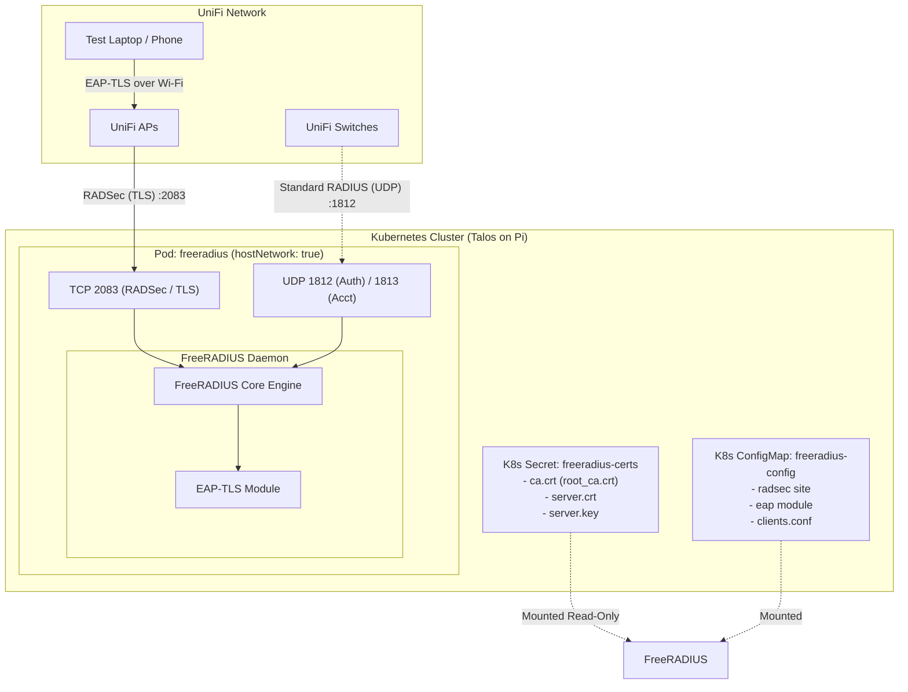

# Implementation Plan - Deploy FreeRADIUS on Kubernetes (Talos / Raspberry Pi)

Deploy FreeRADIUS to the Kubernetes cluster (Talos on Raspberry Pi `arm64`) to provide 802.1X EAP-TLS authentication and RADSec (RADIUS over TLS) for UniFi APs and switches.

---

## User Review Required

> [!IMPORTANT]
> **Network Model Choice:**
> We recommend **`hostNetwork: true`** for this single-node Talos Pi cluster. 
> * **Why:** FreeRADIUS authenticates incoming RADSec/RADIUS packets based on client IP addresses. Standard Kubernetes services perform Source Network Address Translation (SNAT) by default unless configured with a LoadBalancer controller and `externalTrafficPolicy: Local`. `hostNetwork: true` bypasses CNI SNAT entirely, binding directly to the Pi's physical network adapter on ports `1812/UDP`, `1813/UDP`, and `2083/TCP`.
>
> If you already run a LoadBalancer controller on your cluster (e.g. MetalLB, Cilium BGP/L2, or Kube-VIP) and prefer a dedicated virtual IP, let us know!

---

## Proposed Architecture



---

## Proposed Directory & File Structure

```text
RADIUS-Experimentation/
├── certificate-authority/         # (Completed)
│   ├── root_ca.crt / root_ca.key
│   ├── server.crt / server.key
│   ├── unifi-ap.crt / unifi-ap.key
│   └── client.crt / client.key / client.p12
└── k8s/                           # [NEW]
    ├── 00-namespace.yaml          # Dedicated 'freeradius-experimentation' namespace
    ├── 01-deployment-test.yaml    # Test Deployment
    ├── 02-service.yaml            # NodePort Service (externalTrafficPolicy: Local)
    ├── 03-secret-generator.sh     # Script to create/update k8s secret from certs
    └── 04-configmap.yaml          # FreeRADIUS configuration files
```

---

## Detailed Component Plans

### 1. Configuration (`k8s/04-configmap.yaml`)
FreeRADIUS requires several tailored configuration files. Using the official multi-arch image (`freeradius/freeradius-server:latest`, Alpine-based, config at `/etc/raddb`):
* **`clients.conf`**:
  * Defines the `radsec` client block (`proto = tls`, `secret = radsec`) accepting connections from your local subnet.
  * Defines standard UDP clients (for switches or localhost testing).
* **`sites-available/radsec`** (enabled in `sites-enabled/`):
  * Listens on `port = 2083`, `proto = tcp`, `type = auth+acct`.
  * TLS configuration pointing to `/etc/raddb/certs/server.crt`, `/etc/raddb/certs/server.key`, and `/etc/raddb/certs/ca.crt`.
  * `require_client_cert = yes` to enforce mutual TLS with UniFi APs.
* **`mods-available/eap`**:
  * Configures `default_eap_type = tls`.
  * Points EAP-TLS to the same certificates.
* **Dynamic VLAN Assignment Policy** (optional initial rule):
  * Simple mapping: match `TLS-Client-Cert-Common-Name == "andrew-laptop"` to assign:
    * `Tunnel-Type = VLAN (13)`
    * `Tunnel-Medium-Type = IEEE-802 (6)`
    * `Tunnel-Private-Group-Id = "<YOUR_VLAN_ID>"`

### 2. Secret Management (`k8s/03-secret-generator.sh`)
* Creates a Kubernetes Secret named `freeradius-certs` in the `freeradius-experimentation` namespace containing:
  * `ca.crt` (from `root_ca.crt`)
  * `server.crt` (from `server.crt`)
  * `server.key` (from `server.key`)

### 3. Service Manifest (`k8s/02-service.yaml`)
* **Type:** `NodePort` with `externalTrafficPolicy: Local`.
* **Port Mapping:**
  * `32083` (NodePort) ➔ `2083` (RADSec TCP)
  * `31812` (NodePort) ➔ `1812` (RADIUS Auth UDP)
  * `31813` (NodePort) ➔ `1813` (RADIUS Acct UDP)

---

## Verification Plan

### 1. In-Cluster Pod Health
```bash
# Check pod is running
kubectl -n freeradius-experimentation get pods -o wide

# Check FreeRADIUS debug logs on startup
kubectl -n freeradius-experimentation logs -l app=freeradius -f
```
Expected output: FreeRADIUS successfully initializes TLS, binds to TCP port 2083 and UDP ports 1812/1813, and prints `Ready to process requests`.

### 2. RADSec TLS Handshake Verification
From your workstation or another machine on the LAN:
```bash
# Test TLS connectivity to FreeRADIUS port 2083 using unifi-ap client certificate
openssl s_client -connect <PI_IP>:2083 \
  -CAfile certificate-authority/root_ca.crt \
  -cert certificate-authority/unifi-ap.crt \
  -key certificate-authority/unifi-ap.key
```
Expected: `Verify return code: 0 (ok)`, TLS connection established.

### 3. UniFi Controller Profile Configuration
* In UniFi Network, create a RADIUS Profile with **TLS (RADSec)** enabled.
* Upload `root_ca.crt`, `unifi-ap.crt`, and `unifi-ap.key`.
* Point to `<PI_IP>:2083`.
* Watch FreeRADIUS logs to see the UniFi APs establish their RADSec TLS connection.

---

## Future Architecture: Dynamic Authorization (CoA / Disconnect Messages)

* **Objective:** Implement RFC 5176 / RFC 3576 Dynamic Authorization to enable Change of Authorization (CoA) and Disconnect Messages (DM).
* **Use Case:** Force-disconnecting client devices mid-session or dynamically switching authorization policies/VLANs (e.g., upon certificate revocation, security posture failure, or administrative action) without waiting for session expiry or AP re-authentication.
* **Firewall & Protocol Considerations:**
  * **Traditional UDP RADIUS:** Requires the FreeRADIUS server to initiate outbound UDP requests to authenticators (APs/switches) on port `3799`.
  * **RADSec Architecture (Recommended):** Under RFC 6614, CoA and Disconnect messages can be reverse-tunneled through the established persistent TLS connection (TCP `2083`) initiated by the UniFi APs. This preserves strict stateful firewall isolation without requiring inbound firewall pinholes into the management network.
  * **Firewall Policy:** Maintain strict stateful filtering (Management `10.1.0.0/24` ➔ Kubernetes `10.50.0.100`, with reply tracking via `ESTABLISHED,RELATED`).

