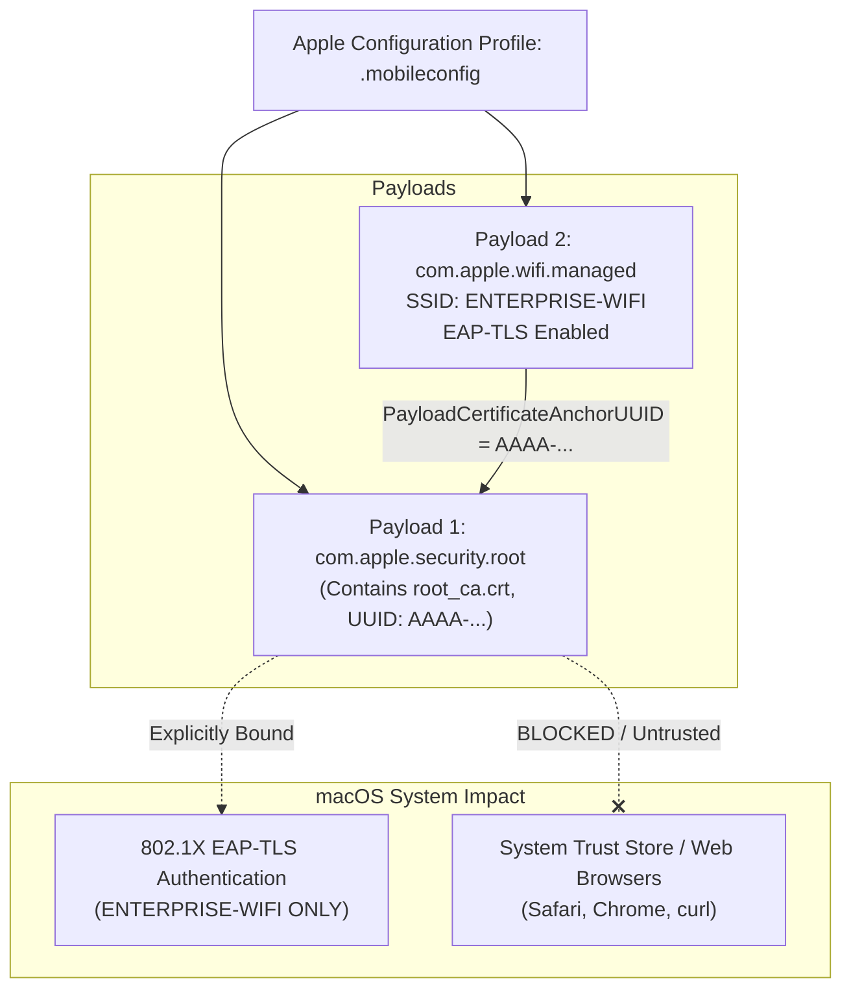
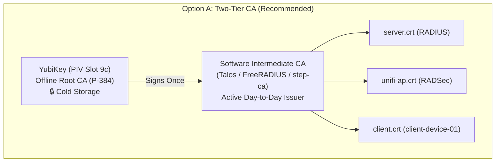

# Client Hardening, Scoped Trust, and Hardware-Backed Identities

This document captures the implementation plan and technical analysis for hardening the client-side configuration of our WPA3-Enterprise 802.1X deployment on macOS (`client-device-01`).

---

## TODO Checklist

- [ ] **Task 1: Clean Removal of Interim Credentials**
  - Remove the test `client.p12` identity (`client-device-01`) from the macOS `login` keychain.
  - Forget the `ENTERPRISE-WIFI` Wi-Fi network to purge cached 802.1X server certificate trust exceptions.
  - Verify that no residual trust settings exist in the macOS System/User trust stores.

- [ ] **Task 2: Build & Deploy Scoped `.mobileconfig` Profile**
  - Generate a signed (or unsigned) Apple Configuration Profile containing:
    - `com.apple.security.root`: Embedded `root_ca.crt` payload.
    - `com.apple.wifi.managed`: Network configuration for `ENTERPRISE-WIFI`.
  - Bind trust exclusively using `PayloadCertificateAnchorUUID` and `TLSTrustedServerNames` so the Root CA is **strictly isolated** to 802.1X EAP-TLS on `ENTERPRISE-WIFI` and completely inactive for general web browsing / SSL.
  - Install and verify profile via macOS System Settings (no MDM required).

- [ ] **Task 3: Hardware-Backed Device Identity (Secure Enclave / Smart Card)**
  - Evaluate the cryptographic curve trade-off:
    - **Apple Secure Enclave (SEP):** Hardware-constrained to **NIST P-256** (does not support P-384). Requires adapting FreeRADIUS cipher list to allow standard WPA3-Enterprise alongside CNSA.
    - **YubiKey 5 (PIV Smart Card):** Supports **NIST P-384** on-chip, preserving strict CNSA 1.0 / Suite B compliance.
  - Implement non-MDM enrollment:
    - *Option A (Automated):* Standalone `.mobileconfig` with a native `com.apple.security.scep` or `com.apple.security.acme` payload enrolling against our local CA.
    - *Option B (Manual CSR):* Lightweight Swift script using `Security.framework` (`kSecAttrTokenIDSecureEnclave`) to generate a CSR on-device and sign it with `step-ca`.

- [ ] **Task 4: Migrate Certificate Authority to a Hardware Root of Trust (YubiKey PIV)**
  - Select an appropriate physical YubiKey (evaluating YubiKey 4 vs 5 and dual-use Passkey implications).
  - Provision Root CA private key directly inside YubiKey PIV hardware (Slot `9c` or `9a`) using **NIST P-384** (`ECCP384`) with mandatory physical touch policy.
  - Evaluate CA hierarchy design:
    - *Option A (2-Tier Offline Root):* YubiKey Root CA mints a software Intermediate CA (for Talos/Kubernetes/FreeRADIUS). YubiKey stays offline in cold storage.
    - *Option B (1-Tier Direct):* YubiKey directly issues leaf certificates via PKCS#11 interface (`step-ca` or OpenSSL).
  - Re-issue server, AP, and client certificates from the hardware-backed CA and update Kubernetes secrets.

---

## Detailed Technical Analysis

### 1. Removing Interim Credentials & Trust

When we imported `client.p12` and associated with `ENTERPRISE-WIFI`, two artifacts were created:
1. **Client Identity (`client-device-01`):** Stored in `login.keychain-db`.
2. **802.1X Server Trust Anchor:** When prompted to verify the RADIUS server certificate during initial connection, macOS stored an approval entry in `/Library/Preferences/SystemConfiguration/com.apple.network.eapolclient.configuration.plist`.

#### Clean Removal Procedure:
```bash
# 1. Delete the client certificate and private key from the login keychain
security delete-certificate -c "client-device-01"

# 2. Forget the Wi-Fi network to purge the cached 802.1X trust exception
networksetup -removepreferredwirelessnetwork en0 "ENTERPRISE-WIFI"

# 3. Verify no lingering trust settings exist in the user domain
security dump-trust-settings
# (Should return: "SecTrustSettingsCopyCertificates: No Trust Settings were found.")
```

---

### 2. Apple Configuration Profiles (`.mobileconfig`) for Scoped Trust

Under normal macOS GUI imports, if a user marks a Root CA as "Always Trust" in Keychain Access, that CA becomes trusted system-wide—enabling it to issue valid certificates for any HTTPS website, potentially creating an inspection/MITM vulnerability.

#### The Zero-Trust Solution: `.mobileconfig`
An Apple Configuration Profile resolves this by scoping trust at the payload level:



#### Key Payload Settings:
* **`PayloadCertificateAnchorUUID`**: Points directly to the UUID of the embedded CA payload. macOS uses this certificate as an anchor *only* when evaluating the TLS server certificate presented during 802.1X association with this SSID.
* **`TLSTrustedServerNames`**: Restricts the accepted RADIUS server names (e.g. `CN=freeradius.homelab.internal`). Even if an attacker possessed our Root CA private key, they could not spoof the RADIUS server without matching this name.
* **No MDM Server Required:** Double-clicking a `.mobileconfig` file on macOS opens **System Settings → Privacy & Security → Profiles**, where the local administrator can approve and install it locally.

---

### 3. Hardware-Backed Device Identity without Enterprise MDM

#### A. The Cryptographic Reality: Apple Secure Enclave vs. CNSA Suite B
The Apple Secure Enclave Processor (SEP) on Apple Silicon (M1/M2/M3/M4) and T2 Intel Macs is a dedicated hardware coprocessor with isolated memory and a hardware RNG:
* **Supported Algorithms:** **NIST P-256 (`secp256r1`)** and RSA (2048/3072/4096-bit).
* **Unsupported:** **NIST P-384 (`secp384r1`) is NOT supported by the Secure Enclave.**

> [!IMPORTANT]
> Our current network is operating in **WPA3-Enterprise 192-bit mode (CNSA 1.0 / Suite B)**, which strictly mandates **NIST P-384** and cipher `ECDHE-ECDSA-AES256-GCM-SHA384`.
> 
> Therefore, we have two distinct directions:
> 1. **Hardware-Backed + Strict CNSA P-384:** Use an external hardware cryptographic token (e.g. **YubiKey 5 Series** PIV slot 9a/9c). macOS natively interfaces with YubiKeys via `CryptoTokenKit`, allowing P-384 keys to be generated on-chip and used for 802.1X authentication.
> 2. **Internal Apple Secure Enclave + Standard WPA3-Enterprise:** Generate a P-256 key inside the Mac's Secure Enclave and adjust FreeRADIUS (`k8s/config/eap`) to accept P-256 certificates alongside or instead of P-384.

#### B. Generating & Enrolling Hardware Keys Without MDM

Enterprise organizations typically use costly MDMs (Jamf, Intune) to push SCEP/ACME payloads that instruct Apple devices to generate keys in the Secure Enclave. However, **the exact same machinery can be run independently at home**:

##### Method 1: Standalone SCEP/ACME `.mobileconfig` (Zero MDM)
macOS contains a native SCEP/ACME client in the operating system (`configd` / `mdmclient`). You can author a `.mobileconfig` with:
```xml
<key>PayloadType</key>
<string>com.apple.security.scep</string>
<key>URL</key>
<string>http://ca.homelab.internal/scep</string>
<key>Key Type</key>
<string>EC</string>
<key>Key Size</key>
<integer>256</integer>
<key>KeyIsExtractable</key>
<false/>
<key>HardwareBound</key>
<true/>
```
When imported locally:
1. macOS commands the Secure Enclave to generate the P-256 private key. The key never leaves the enclave.
2. macOS generates a PKCS#10 Certificate Signing Request (CSR) on the device.
3. macOS submits the CSR to your SCEP endpoint (e.g. `step-ca`), fetches the issued certificate, and bundles it with the non-exportable hardware key.

##### Method 2: Local Swift CSR Generator (Air-Gapped / No SCEP Daemon)
If you do not want to run a continuous SCEP server, a small Swift command-line tool using macOS's `Security.framework` can generate the key and CSR manually:
```swift
import Foundation
import Security

let access = SecAccessControlCreateWithFlags(
    kCFAllocatorDefault,
    kSecAttrAccessibleAfterFirstUnlockThisDeviceOnly,
    [.privateKeyUsage],
    nil
)!

let attributes: [String: Any] = [
    kSecAttrKeyType as String:            kSecAttrKeyTypeECSECPrimeRandom,
    kSecAttrKeySizeInBits as String:      256,
    kSecAttrTokenID as String:            kSecAttrTokenIDSecureEnclave, // Hardware-bound
    kSecPrivateKeyAttrs as String: [
        kSecAttrIsPermanent as String:    true,
        kSecAttrAccessControl as String:  access,
        kSecAttrLabel as String:          "client-device-01-wifi-identity"
    ]
]

var error: Unmanaged<CFError>?
guard let privateKey = SecKeyCreateRandomKey(attributes as CFDictionary, &error) else {
    fatalError("Failed to generate key in Secure Enclave: \(error!.takeRetainedValue())")
}

// Generate PKCS#10 CSR using SecKeyCreateSignature...
```
Once the CSR is exported:
1. Sign the CSR on your CA using `step certificate sign client-device-01.csr client.crt --ca root_ca.crt --ca-key root_ca.key`.
2. Import `client.crt` back into Keychain. macOS automatically matches the public key in `client.crt` with the non-exportable private key residing in the Secure Enclave.

---

### 4. Hardware Root of Trust CA Migration (YubiKey PIV)

To establish the ultimate zero-trust security posture for our homelab NAC, we will migrate the software Root CA (`root_ca.key` currently stored unencrypted on disk) into a dedicated hardware token (YubiKey).

#### A. YubiKey 4 Series vs. YubiKey 5 Series

| Feature | YubiKey 4 Series | YubiKey 5 Series |
| :--- | :--- | :--- |
| **PIV Applet (Smart Card)** | Supported | Supported |
| **Elliptic Curve Support (PIV)** | **ECCP256, ECCP384** | **ECCP256, ECCP384**, Ed25519 (firmware 5.7+) |
| **RSA Support (PIV)** | RSA 1024, RSA 2048 | RSA 2048, RSA 3072, RSA 4096 (firmware 5.7+) |
| **FIDO2 / WebAuthn (Passkeys)** | **Not Supported** (U2F only) | **Full Support** (Resident Passkeys) |
| **CryptoTokenKit / PKCS#11** | Fully compatible (`libykcs11`, OpenSC) | Fully compatible (`libykcs11`, OpenSC) |

> [!IMPORTANT]
> **Both the YubiKey 4 and YubiKey 5 natively support NIST P-384 (`ECCP384`) in their PIV applets.**
> This means either device is cryptographically capable of serving as our Root CA while strictly maintaining **CNSA 1.0 (WPA3-Enterprise 192-bit / Suite B)** compliance!

#### B. Dual-Use Considerations: PIV CA vs. WebAuthn Passkeys

If a YubiKey is already being used as a backup Passkey for online websites, consider:

1. **Cryptographic & Logical Isolation:**
   - On a YubiKey, **the PIV applet and the FIDO2/WebAuthn applet are completely separated**.
   - PIV has its own PIN, PUK, and 24-byte 3DES/AES Management Key (`010203...`).
   - FIDO2 has its own separate PIN and credential database.
   - Initializing, generating keys in, or resetting the PIV applet **will never erase or affect FIDO2 Passkeys**, and vice versa.
2. **Operational Security (OpSec) & Cold Storage:**
   - A **Root CA private key** is the cryptographic foundation of the entire homelab. Standard industry practice requires Root CAs to remain **cold / offline** (stored in a safe or drawer, only attached to an air-gapped machine when signing an Intermediate CA or revoking credentials).
   - An interactive **daily driver or backup Passkey** is something you plug in regularly for web browsing, carry around, or keep on a keychain.
   - **Recommendation:** **Dedicate a YubiKey 4 series as the offline Root CA.**
     - Since the YubiKey 4 cannot store modern FIDO2 Passkeys anyway, dedicating it entirely to the Root CA avoids tying up your versatile YubiKey 5 devices.
     - The YubiKey 4 can live offline in cold storage, safely holding the non-exportable P-384 Root CA key.

#### C. CA Architecture Options



* **Option A: Two-Tier Hierarchy (Recommended):**
  - The YubiKey generates an `ECCP384` Root CA in slot `9c` (Digital Signature) with `TOUCH_POLICY_ALWAYS`.
  - The YubiKey is plugged in **once** to sign an Intermediate CA certificate.
  - The Intermediate CA runs in Kubernetes or on the admin workstation to mint short- or medium-lived leaf certificates.
  - The YubiKey Root CA is unplugged and returned to cold storage.
* **Option B: Single-Tier Direct CA:**
  - The YubiKey directly signs every leaf certificate (`server.crt`, `unifi-ap.crt`, `client.crt`) via `yubico-piv-tool` or Smallstep's PKCS#11 HSM provider.
  - Requires plugging in and physically touching the YubiKey whenever a new certificate is issued.

#### D. Tooling & Provisioning Commands
When we are ready to implement Task 4, we will use `yubikey-manager` (`ykman`):
```bash
# 1. Check connected key model and firmware
ykman info

# 2. Generate NIST P-384 key directly in PIV Slot 9c with touch policy enforced
ykman piv keys generate \
    --algorithm ECCP384 \
    --pin-policy ONCE \
    --touch-policy ALWAYS \
    9c root_ca.pub

# 3. Generate self-signed Root CA certificate directly on the hardware token
ykman piv certificates generate \
    --subject "CN=Homelab Hardware Root CA,O=Homelab,C=US" \
    --valid-days 3650 \
    9c root_ca.pub
```

